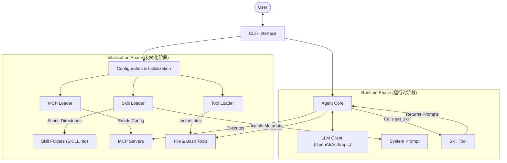
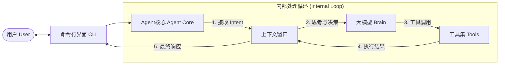
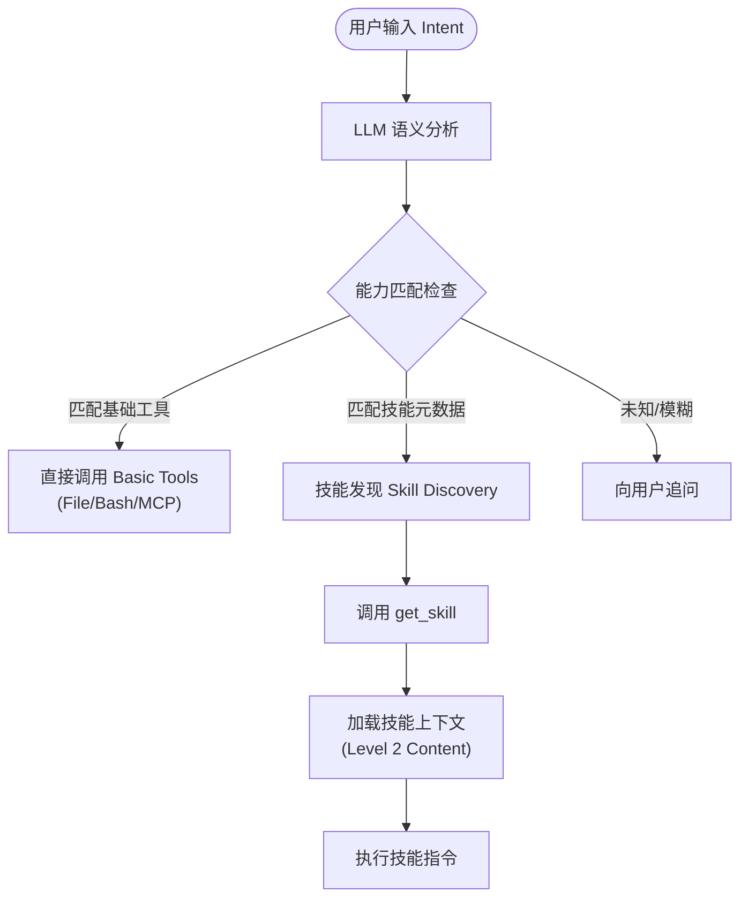
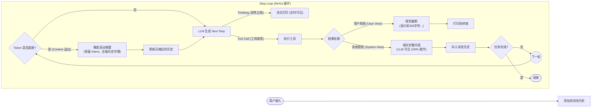
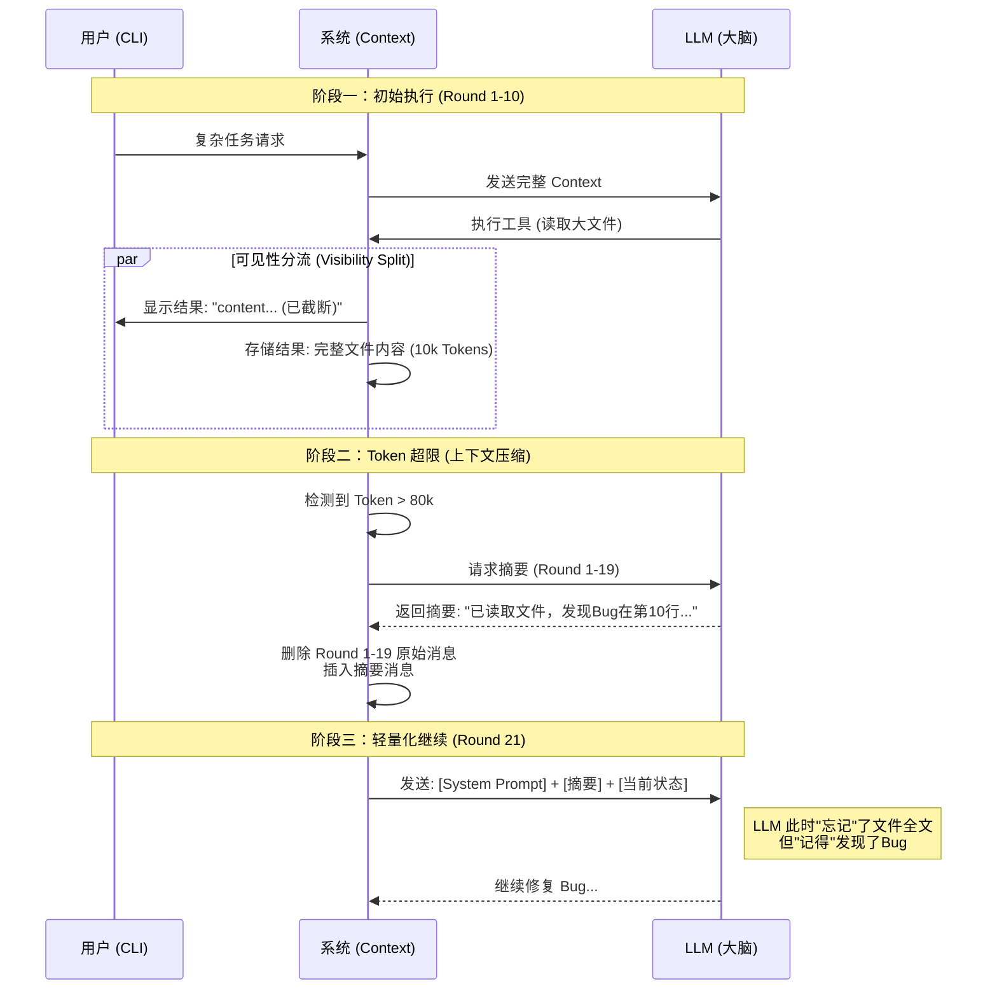
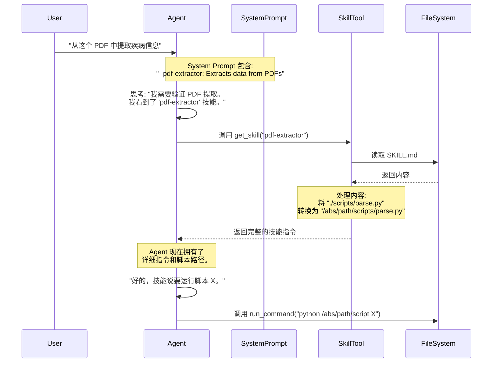
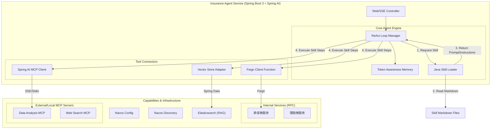
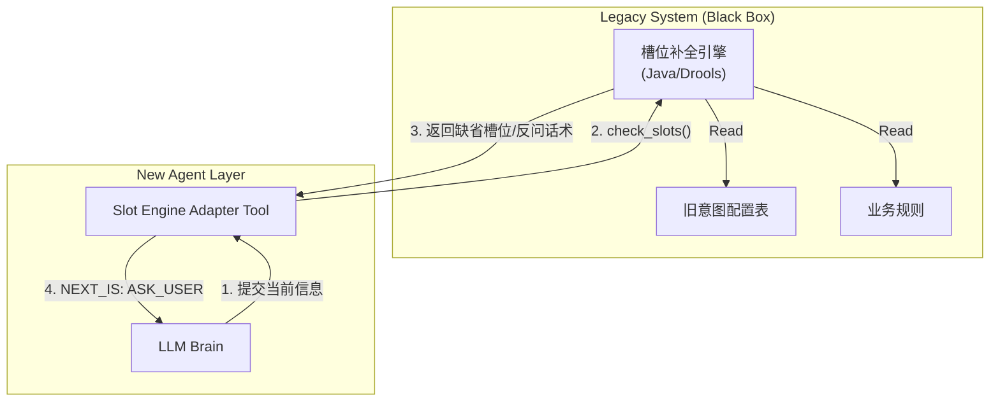
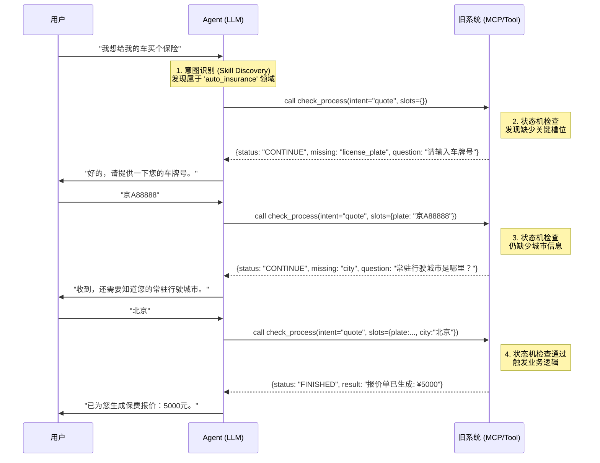

# Mini-Agent 项目设计分析

本文档详细分析了 **Mini-Agent** 项目的设计架构、执行逻辑以及独特的“技能系统”（Skill System）。

## 1. 高层架构概览 (High-Level Architecture Overview)

**Mini-Agent** 框架基于模块化架构构建，旨在实现可扩展性和**渐进式披露（Progressive Disclosure）**。它将核心 Agent 运行时与其可获取的能力（Skills/Tools）分离开来。



## 2. 核心 Agent 执行流程 (Core Agent Execution Flow)

### 2.1 整体问答交互架构 (Q&A Interaction Architecture)

Agent 的核心是一个持续的交互循环。用户输入启动任务，Agent 在内部进行多次推理和工具调用（ReAct 循环），直到得出最终结论。



### 2.2 意图识别与动态路由机制 (Intent Recognition & Dynamic Routing)

Mini-Agent 不依赖传统的分类器进行意图识别，而是采用 **LLM 驱动的动态路由**。系统通过 Prompt Engineering 将意图识别内化为模型的推理过程。

1.  **语义匹配**：LLM 自动将用户需求与 System Prompt 中的 **工具描述** 和 **技能元数据** 进行匹配。
2.  **决策分流**：
    *   **简单意图**：直接映射到基础工具（如 `read_file`, `bash`）。
    *   **复杂意图**：触发 **技能发现 (Skill Discovery)** 流程，调用 `get_skill` 加载专家知识。



### 2.3 详细 ReAct 循环与 Token 管理 (Detailed ReAct Loop & Memory)

Agent 遵循经典的 **ReAct** 模式，其独特之处在于集成了 **Token 动态监控** 和 **滚动摘要** 机制，确保在有限的上下文窗口内处理无限的任务步骤。

Agent 遵循经典的 **ReAct (Reasoning + Acting)** 循环，并增强了高效的 Token 管理和状态处理机制。

**关键组件：**

*   **状态管理 (State Management)**：维护消息历史记录（System, User, Assistant, Tool）。
*   **Token 优化 (Token Optimization)**：当 Token 超过限制时，自动对旧的对话轮次进行摘要，防止上下文溢出。
*   **取消处理 (Cancellation Handling)**：通过在单独线程中运行监听器，支持实时中断（例如按下 `Esc` 键）。



### 2.4 长链路任务的时序逻辑与上下文压缩 (Long-Running Task Timeline & Context Compression)

当任务链路非常长（例如 >50 轮）时，系统通过**滚动摘要 (Rolling Summary)** 来“遗忘”细节但“记住”结论。



## 3. "技能系统" (Skill System) - 渐进式披露

这是设计中最独特的部分。Agent 不是在启动时硬编码所有能力或加载大量 Prompt 上下文，而是使用**渐进式披露（Progressive Disclosure）**。

1.  **发现 (Discovery - Level 1)**：System Prompt 中只告知 Agent *有哪些* 技能存在（仅包含元数据：名称 + 描述）。
2.  **按需加载 (On-Demand Loading - Level 2)**：如果 Agent 确定需要特定技能来解决任务，它会调用 `get_skill` 工具。
3.  **获取 (Acquisition)**：工具读取 `SKILL.md`，将Markdown中的相对路径转换为绝对路径（以便 Agent 能稳健地读取引用的文件），并返回完整的指令内容。
4.  **执行 (Execution)**：Agent 接收到详细指令，并根据技能的指示使用标准工具（如 `run_command` 或 `read_file`）执行任务。



## 4. 组件详情 (Component Details)

### A. `SkillLoader` (`mini_agent/tools/skill_loader.py`)
*   **角色**：扫描 `./skills` 或包目录，查找包含 `SKILL.md` 的文件夹。
*   **路径标准化**：至关重要的一点是，它将 Markdown 中的相对路径（例如 `[Config](./config.json)`）转换为绝对路径。这确保了无论 Agent 在哪里运行，都能找到技能引用的资源。

### B. `Agent` 类 (`mini_agent/agent.py`)
*   **`_summarize_messages()`**：实现了“滚动摘要”策略。它保持 System Prompt 和元数据不变，但对之前轮次的中间执行步骤进行摘要，以节省上下文窗口空间。
*   **`run()`**：管理请求生命周期的主要入口点，包括循环、取消检查和工具执行。

### C. `Tool` 接口
*   标准接口 (`name`, `description`, `parameters`, `execute`)。
*   支持本地 Python 函数（如 `EditTool`, `BashTool`）和通过 **MCP** (Model Context Protocol) 动态加载的工具。

## 5. 设计哲学总结 (Summary of Design Philosophy)

1.  **轻量级核心 (Lightweight Core)**：Agent 以最小的上下文启动，确保存储速度和低成本。
2.  **按需上下文 (Context on Demand)**：仅在特定任务需要时才加载繁重的指令（Skills）。
3.  **工具优先 (Tool-First)**：一切皆工具，包括学习新技能的能力。
4.  **开发者体验 (Developer Experience)**：技能只是 Markdown 文件和文件夹，易于创建、阅读和维护，无需编写复杂的 Python 插件代码。

## 6. 长链路任务处理与可见性 (Long-Running Tasks & Visibility)

针对包含大量步骤的复杂长链路任务，系统在**用户可见性**和**上下文管理**之间取得了平衡。

### A. 实时流式输出 (Real-time Feedback)
用户无需等待任务完全结束即可看到进展。CLI 界面保证了每个步骤的透明度：
*   **思考过程 (Thinking)**：实时打印思维链（CoT），展示 Agent 的决策逻辑。
*   **工具调用 (Tool Calls)**：显示调用的工具函数名及其实际参数。
*   **执行结果 (Tool Results)**：即时反馈工具的执行状态。

### B. 视觉截断 (Visual Truncation)
为了防止大量数据（如读取大文件）刷屏影响体验，`agent.py` 对**用户侧输出**进行了截断处理：
```python
# agent.py (示意)
if len(result_text) > 300:
    result_text = result_text[:300] + "..."
```
*   **用户**：看到简洁的摘要。
*   **Agent**：接收完整的上下文数据，确保逻辑判断准确。

### C. 记忆压缩 (Rolling Summary)
为了解决长链路导致的 Context Window 溢出问题，系统实现了滚动摘要机制：
1.  **触发**：当 Token 数超过阈值（默认 80k）。
2.  **保留**：始终保留 System Prompt（核心设定）和 User Message（原始意图）。
3.  **压缩**：将中间的执行过程（Assistant & Tool Messages）发送给 LLM 生成精简摘要。
4.  **效果**：Agent "记住"了过去步骤的**结论**，"忘记"了过时的**细节**，从而能持续处理超长任务。

## 7. 项目关键设计实现细节 (Critical Design Implementation Details)

### 7.1 核心系统提示词逻辑 (Core System Prompt Design)
`system_prompt.md` 是 Agent 的"灵魂"，采用了分层结构设计，确保 Agent 既有通用能力又能从环境中获取动态知识。

```markdown
You are Mini-Agent...

## Core Capabilities
### 1. Basic Tools (File, Bash, MCP)
...

### 2. Specialized Skills (Progressive Disclosure)
You have access to specialized skills...
- Level 1 (Metadata): You see skill names and descriptions below
- Level 2 (Full Content): Load a skill's complete guidance using `get_skill`
...

{SKILLS_METADATA}  <-- 关键设计：运行时动态注入技能列表
...
```
*   **设计亮点**：通过 `{SKILLS_METADATA}` 占位符，`SkillLoader` 在启动时动态扫描目录并注入技能表。这意味着**增加新技能只需在文件夹中放入 markdown 文件，无需修改代码**。

### 7.2 上下文压缩/滚动摘要提示词 (Context Compression Prompt Logic)
在 `agent.py` 的 `_create_summary` 方法中，使用了专门的提示词来生成从"细节"到"结论"的压缩记忆。

```python
summary_prompt = f"""Please provide a concise summary of the following Agent execution process:
{summary_content}

Requirements:
1. Focus on what tasks were completed and which tools were called
2. Keep key execution results and important findings
3. Be concise and clear, within 1000 words
..."""
```
*   **设计思路**：强制要求 LLM 关注 **"做了什么" (Called tools)** 和 **"发现了什么" (Findings)**，而忽略"用户说好的"这类的闲聊，从而实现高压缩比的信息留存。

### 7.3 Skill 系统的关键路径转换设计 (Skill Path Normalization)
Skill 系统最核心的难点在于：Markdown 编写时是**相对路径**（便于阅读），但 Agent 执行时需要**绝对路径**（确保稳定）。
`SkillLoader._process_skill_paths` 实现了这一转换逻辑：

```python
# 原始 SKILL.md 写法:
# "运行 [Script](./scripts/demo.py)"

# 转换后的 Prompt (Agent 看到的):
# "运行 [Script](/User/admin/mini-agent/skills/demo-skill/scripts/demo.py)"
```
*   **核心正则逻辑**：
    *   匹配 `(python|run) script/xxx` -> 转换为绝对路径
    *   匹配 `see reference.md` -> 转换为绝对路径并提示 `(use read_file to access)`
    *   匹配 Markdown 链接 `[text](./path)` -> 转换为绝对路径

这一设计保证了 Skill 具备 **"Write Once, Run Anywhere"** 的可移植性。

### 7.4 Skill 提示词渲染实列 (Skill Prompt Rendering Example)

为了更清晰地理解 Skill 是如何变成 LLM 的 Prompt 的，我们来看一个具体的 **Before (源代码)** 与 **After (Agent 视角)** 的对比。

**Before (`SKILL.md` 源代码)**:
```markdown
---
name: pdf-extractor
description: Extracts text from PDFs.
---

# Extracting PDFs

First, run the extraction script:
python ./scripts/extract.py --input test.pdf

Then, read the config:
Check [Config](./config.json) for settings.
```

**After (Agent 收到的最终 Prompt)**:
当 Agent 调用 `get_skill('pdf-extractor')` 后，`SkillLoader` 会生成如下 Prompt 返回给 LLM：
```markdown
# Skill: pdf-extractor

Extracts text from PDFs.

**Skill Root Directory:** `/Users/zhangwei/work/mini-agent/skills/pdf-extractor`

All files and references in this skill are relative to this directory.

---

# Extracting PDFs

First, run the extraction script:
python /Users/zhangwei/work/mini-agent/skills/pdf-extractor/scripts/extract.py --input test.pdf

Then, read the config:
Check [Config](`/Users/zhangwei/work/mini-agent/skills/pdf-extractor/config.json`) (use read_file to access) for settings.
```

**关键变化点**：
1.  **头部注入**：自动添加了 Skill 名称、描述和 **根目录路径** 的说明。
2.  **脚本路径**：`./scripts/extract.py` -> `/Users/.../scripts/extract.py`（绝对路径，Agent 可直接由 `run_command` 执行）。
3.  **文件链接**：`[Config](./config.json)` -> 绝对路径，并追加了 `(use read_file to access)` 提示，明确指导 Agent 如何操作。

这种转换确保了 Agent 作为一个“甚至不知道自己在哪个目录”的 AI，也能准确无误地操作 Skill 中的资源。

## 8. 业务系统改造开发指南 (Development Guide for Business System Integration)
本指南旨在帮助业务系统开发工程师理解如何基于 Mini-Agent 架构进行系统升级与能力扩展。

### 8.1 核心系统提示词模板 (System Prompt Template)
业务系统在集成 Agent 时，应参考以下标准 System Prompt 结构。请注意 `{SKILLS_METADATA}` 是必须保留的插槽。

```markdown
You are Mini-Agent, a versatile AI assistant powered by MiniMax, capable of executing complex tasks through a rich toolset and specialized skills.

## Core Capabilities

### 1. **Basic Tools**
- **File Operations**: Read, write, edit files with full path support
- **Bash Execution**: Run commands, manage git, packages, and system operations
- **MCP Tools**: Access additional tools from configured MCP servers

### 2. **Specialized Skills**
You have access to specialized skills that provide expert guidance and capabilities for specific tasks.

Skills are loaded dynamically using **Progressive Disclosure**:
- **Level 1 (Metadata)**: You see skill names and descriptions (below) at startup
- **Level 2 (Full Content)**: Load a skill's complete guidance using `get_skill(skill_name)`
- **Level 3+ (Resources)**: Skills may reference additional files and scripts as needed

**How to Use Skills:**
1. Check the metadata below to identify relevant skills for your task
2. Call `get_skill(skill_name)` to load the full guidance
3. Follow the skill's instructions and use appropriate tools (bash, file operations, etc.)

---

{SKILLS_METADATA}

## Working Guidelines
... (Add your specific business guidelines here)
```

### 8.2 创建新的业务技能 (Creating New Business Skills)
业务侧可以通过定义新的 Skill 来扩展 Agent 能力，而无需修改核心代码。遵循以下规范创建 `SKILL.md`：

#### 目录结构
```
skills/
  └── my-business-logic/      <-- 技能目录名（必须与 name 一致）
      ├── SKILL.md            <-- 核心定义文件
      ├── scripts/            <-- 辅助脚本（可选）
      │   └── process_data.py
      └── templates/          <-- 模板文件（可选）
          └── report.html
```

#### SKILL.md 规范
```markdown
---
name: my-business-logic
description: 处理核心业务逻辑，如订单查询、报表生成等。
---

# My Business Logic Skill

这是一份指导 Agent 如何执行特定业务任务的说明书。

## 1. 订单查询
运行以下脚本查询订单详情：
python ./scripts/process_data.py --order-id <ID>

## 2. 生成报告
读取模板文件：
Read [Template](./templates/report.html) to understand the format.
```

### 8.3 关键注意事项
1.  **路径无关性**：在 `SKILL.md` 中始终使用**相对路径**（如 `./scripts/xxx`）。`SkillLoader` 会自动将其转换为绝对路径，确保 Agent 无论在哪个目录下工作都能找到文件。
2.  **环境隔离**：如果业务脚本依赖特定的 Python 包，请在 `SKILL.md` 中明确指示 Agent 检查并安装依赖（建议使用 `uv`）。
3.  **渐进式披露**：不要把所有 Prompt 都写在 System Prompt 里。将特定领域的知识封装在 Skill 中，仅在识别到相关意图时才加载，这能显著降低 Token 消耗并提高准确率。


## 9. 保险行业智能体实战集成方案 (Pure Java/Spring Cloud Implementation)

**约束条件**: 必须统一使用 Java Spring Cloud 技术栈，不引入 Python 运行时。
**核心思路**: 将 Mini-Agent 的设计思想（ReAct循环、滚动摘要、渐进式披露 Skill）**移植**到 Java 生态中，利用 **Spring AI** 框架重构 Agent 核心。

### 9.1 纯 Java Agent 混合架构拓扑 (Hybrid Java Architecture)

Spring AI 不仅支持传统的 Feign 调用，也原生支持 MCP 协议。
**关键设计流向**：Agent 首先通过 `Skill Loader` 获取特定 Skill 的 Prompt 指令（例如各步骤的编排逻辑），**然后基于这些指令**去驱动具体的 RAG 检索或 MCP 工具调用。



### 9.2 核心模块移植指南

由于无法直接使用 Python 代码，我们需要在 Java 中复刻 Mini-Agent 的关键能力。

#### A. ReAct 循环与记忆管理 (Spring AI Implementation)
使用 Spring AI 的 `Advisor` 机制来实现 Token 管理和滚动摘要。

```java
// AgentService.java
public Flux<String> runAgent(String userQuery) {
    return chatClient.prompt()
        .system(systemPrompt)
        .user(userQuery)
        .advisors(
            // 移植 2.3 节的 Token 管理逻辑
            new RollingSummaryAdvisor(tokenLimit=8000), 
            // 移植 2.2 节的意图识别与工具增强
            new QuestionAnswerAdvisor(vectorStore) 
        )
        .functions("queryPolicy", "checkClaimStatus") // 直接绑定 Java Bean 方法
        .stream()
        .content();
}
```

#### B. Skill 系统的 Java 化 (Resource-based Skill Loader)
推荐将 Skill 文件打包在 `src/main/resources/skills` 目录下，利用 Spring 的 `ResourceLoader` 进行加载，这符合 Java 工程的最佳实践（打包部署、版本一致性）。

1.  **目录结构**:
    ```text
    src/main/resources/
      └── skills/
          └── insurance-knowledge/
              ├── SKILL.md
              └── config.json
    ```

2.  **核心实现 (`SkillLoaderService.java`)**:
    使用 `PathMatchingResourcePatternResolver` 扫描 classpath。

    ```java
    @Service
    public class SkillLoaderService {
        @Autowired
        private ResourcePatternResolver resourceResolver;

        // 扫描并预加载所有 Skill
        @PostConstruct
        public void loadSkills() throws IOException {
            // 扫描 resources/skills 下的所有 SKILL.md
            Resource[] resources = resourceResolver.getResources("classpath*:skills/**/SKILL.md");
            for (Resource r : resources) {
                String content = r.getContentAsString(StandardCharsets.UTF_8);
                // 解析 Frontmatter (Yaml) + Body (Markdown)
                parseAndRegister(content);
            }
        }

        // 提供给 Agent 的 Tool Function
        @Bean
        @Description("Load specialized skill content")
        public Function<SkillRequest, String> getSkill() {
            return request -> {
                String raw = skillMap.get(request.skillName());
                // 关键：将 classpath 相对路径转换为 Runtime 绝对路径或 Web 引用
                return processPaths(raw);
            };
        }
    }
    ```

#### C. 微服务工具化 (Feign as Tools)
在 Spring AI 中，现有的 Feign Client 可以直接注册为 Agent 的 Tool。

```java
@Configuration
public class ToolConfig {
    
    @Bean
    @Description("根据保单号查询详情")
    public Function<PolicyQuery, PolicyResult> queryPolicy(PolicyFeignClient policyClient) {
        return query -> policyClient.getPolicyDetail(query.policyNo());
    }
}
```

### 9.3 RAG 检索集成 (Spring Data ES)
利用 Spring Data Elasticsearch 实现 RAG，并将其封装为一个 Function Tool。

1.  **定义 DO/Repository**: 映射 ES 索引。
2.  **实现检索 Tool**:
    ```java
    @Bean
    @Description("Search insurance terms and rules")
    public Function<SearchQuery, String> searchKnowledge(IsuranceEsRepository esRepo) {
        return query -> {
            // 1. Keyword search / Vector search
            var results = esRepo.findByContentMatches(query.keyword());
            // 2. Format as context string
            return formatResults(results);
        };
    }
    ```

### 9.4 部署与运维
*   **服务注册**：Agent 服务作为一个标准的微服务注册到 Nacos/Eureka。
*   **配置管理**：System Prompt 和 Token 阈值通过 Nacos 动态下发。
*   **鉴权**：复用现有的 Spring Security / OAuth2 体系。

### 总结
该方案完全遵循 **Spring Cloud** 标准，将 Agent 作为一个普通的 Java 微服务进行开发。虽然需要重写核心逻辑，但能完美融入现有的监控、日志（SkyWalking/ELK）和运维体系，且通过 Spring AI 简化了 LLM 对接成本。

## 10. 遗留系统迁移策略：从槽位填充到 Agent (Legacy Migration: Slot-Filling to Agent)

针对上一代基于 **"意图识别 + 槽位补全 (Slot Filling) + 规则引擎"** 的对话系统，我们采取 **"引擎工具化 (Engine as a Tool)"** 的升级策略。

**核心原则**：不要试图用 LLM 的 Prompt 替代复杂的业务状态机（State Machine），而是将旧的状态机封装为 Agent 手中的一个 **"确定性工具"**。

### 10.1 迁移架构：状态机即工具 (State Machine as a Tool)



### 10.2 详细交互流程 (Sequence Flow)

假设旧系统有一个 "车险报价" 意图，必须收集：`车牌号`、`车主姓名`、`行驶城市`。



### 10.3 迁移收益
1.  **零幻觉**：业务流程的严谨性由旧代码保证，LLM 不会"编造"流程。
2.  **体验升级**：LLM 负责将旧引擎僵硬的"反问话术"转化为自然语言，并能处理用户的打断、闲聊（这些是旧系统做不到的），最后再回归业务主线。
3.  **资产复用**：无需重写复杂的 Drools 规则或代码逻辑，平滑演进。


