# Mini-Agent 系统架构设计文档

本文档详细描述了 Mini-Agent 项目的系统架构、数据流转及关键技术细节。

## 1. 系统概览 (System Overview)

Mini-Agent 是一个基于 Python 的轻量级、高扩展性 AI Agent 框架。它旨在通过 LLM (Large Language Model) 实现自主的任务规划与执行。其核心设计理念是**工具即能力**，通过 MCP (Model Context Protocol) 和本地技能库 (Skills) 赋予 Agent 丰富的操作环境能力。

### 核心特性
- **多模型支持**: 兼容 OpenAI 及 Anthropic 接口标准的各类 LLM。
- **MCP 协议集成**: 支持 Model Context Protocol，可无缝接入标准化的外部工具服务。
- **技能库 (Skills)**: 基于文件系统的动态能力加载机制，易于扩展。
- **智能上下文管理**: 内置 Token 计数与自动摘要机制，支持长会话。
- **健壮的容错机制**: 网络请求重试与工具执行错误处理。

---

## 2. 系统核心架构 (Core Architecture)

系统整体采用分层架构设计，主要分为：**配置层**、**核心控制层**、**能力层** 和 **基础设施层**。

### 2.1 模块划分

1.  **核心控制层 (`mini_agent/agent.py`)**
    -   **Agent 类**: 系统的“大脑”。负责维护会话状态、管理消息历史、调度 LLM 进行推理、解析工具调用请求并执行。
    -   包含主循环 `run()`，实现 "思考-行动-观察" (ReAct) 范式。

2.  **模型适配层 (`mini_agent/llm/`)**
    -   **LLMClient**: 抽象基类，定义统一的 `generate` 接口。
    -   **OpenAIClient / AnthropicClient**: 具体实现，处理不同厂商 API 的差异（如消息格式、Thinking 模式等）。

3.  **能力与工具层 (`mini_agent/tools/` & `mini_agent/skills/`)**
    -   **Base Tool**: 所有工具的基类。
    -   **System Tools**: 内置的基础工具，如 `FileEditorTool` (文件操作), `BashTool` (命令行), `NoteTool` (记忆)。
    -   **Skills System**: 加载 `skills/` 目录下的 Markdown 定义，将其转化为 Agent 可理解的 Prompt 增强或复合指令。
    -   **MCP Client**: 连接外部 MCP Server，动态发现和调用远程工具。

4.  **配置与基础设施 (`mini_agent/config/` etc.)**
    -   **Config**: 基于 Pydantic 的配置校验，支持 YAML 及环境变量加载。
    -   **Logger**: 结构化日志记录，追踪 Agent 的思考过程和执行结果。

---

## 3. 数据架构设计 (Data Architecture)

### 3.1 数据流转设计

Mini-Agent 的运行本质上是一个不断迭代的状态机。数据在 User、Agent、LLM 和 Tools 之间流转。

#### 核心数据流转图 (Data Flow Diagram)

```mermaid
graph TD
    subgraph Initialization
        Config[config.yaml] -->|Load| ConfigObj[Config Object]
        SystemPrompt[System Prompt] -->|Inject| AgentState
        Workspace[Workspace Dir] -->|Mount| AgentState
    end

    subgraph Agent Loop
        User[User Input] -->|Add| History[Message History]
        History -->|Format| LLMRequest[LLM Request Payload]
        
        subgraph Context Management
            History -->|Analyze| TokenCounter[Token Counter]
            TokenCounter -->|Exceeds Limit?| Summarizer[Summarizer]
            Summarizer -->|Compress| History
        end

        LLMRequest -->|Send| LLM[LLM Provider]
        LLM -->|Response| Message[Assistant Message]
        
        Message -->|Contains Tool Calls?| Decision{Tool Call?}
        
        Decision -- Yes --> ToolParser[Parse Tool Args]
        ToolParser -->|Execute| ToolRunner[Tool Executor]
        
        subgraph Tool Execution
            ToolRunner -->|Local| FileSys[File System / Bash]
            ToolRunner -->|MCP| MCPServer[MCP Server]
        end
        
        ToolExecution -->|Result| ToolOutput[Tool Result]
        ToolOutput -->|Append| History
        ToolOutput -->|Loop| LLMRequest
        
        Decision -- No --> FinalResult[Final Response]
        FinalResult -->|Output| User
    end
```



### 3.2 关键数据结构

1.  **Message (消息对象)**
    -   用于在 Agent 与 LLM 之间传递信息的标准化单元。
    -   结构示例：
        ```python
        class Message:
            role: str          # "system", "user", "assistant", "tool"
            content: str       # 文本内容
            tool_calls: List   # 模型生成的工具调用请求
            tool_call_id: str  # 关联的工具调用 ID (用于 tool 类型的消息)
            thinking: str      # (可选) 模型的思维链内容
        ```

2.  **ToolResult (工具结果)**
    -   标准化工具执行的返回格式，无论工具是本地函数还是远程 MCP 调用。
    -   结构示例：
        ```python
        class ToolResult:
            success: bool      # 执行是否成功
            content: str       # 执行输出或错误信息
            error: str         # 错误详情
        ```

3.  **Config (配置对象)**
    -   `LLMConfig`: API Key, Model, Base URL.
    -   `AgentConfig`: Max Steps, Workspace Path.
    -   `ToolsConfig`: Enable flags for various toolsets.

---

## 4. 关键技术细节 (Key Implementation Details)

### 4.1 上下文自动压缩 (Context Summarization)
为了应对长任务中的 Token 限制，Mini-Agent 实现了一套**滚动摘要机制** `_summarize_messages`：
1.  **触发条件**: 当本地估算 Token 或 API 返回的 Total Token 超过 `token_limit` 阈值。
2.  **保留策略**: 
    -   始终保留 `System Prompt`。
    -   保留所有 `User` 消息（作为意图锚点）。
    -   保留最近的一轮交互（保证当前上下文的连贯性）。
3.  **压缩动作**: 将历史的 "User -> Assistant (Tools) -> Tool Result" 链条，调用 LLM 生成一段自然语言的 Summary，替换掉原始的详细日志。

### 4.2 错误处理与重试 (Error Handling & Retry)
1.  **LLM 调用层**: 使用 `Tenacity` 或自定义 Retry 逻辑处理网络波动与 Rate Limit。
2.  **工具执行层**: 
    -   在 `Agent.run` 循环中捕获所有工具执行异常。
    -   将 Exception 堆栈转化为 `ToolResult(success=False)` 返回给 LLM。
    -   **关键设计**: 错误信息被“反馈”给 LLM，允许 LLM 自我纠正（例如修正错误的文件路径或参数）。

### 4.3 异步与并发
项目广泛采用了 Python 的 `asyncio`：
-   核心 `Agent.run` 为异步方法。
-   MCP 工具通信基于 SSE (Server-Sent Events) 的异步流。
-   支持长时间运行的工具不阻塞主线程心跳。

### 4.4 技能扩展 (Skill Expansion)
不同于传统的硬编码工具，`Skills` 允许用户通过 Markdown 文件定义新能力：
-   Agent 读取 `SKILL.md` 理解任务流程。
-   通过 `scripts/` 目录执行复杂的脚本逻辑。
-   实现了 "Code as Prompt" 和 "Code as Tool" 的混合模式。

---

## 5. 生产环境能力评估 (Production Readiness Assessment)

### 5.1 并发模型与性能 (Concurrency & Performance)
本框架基于 Python `asyncio` 构建，这为高并发 I/O 密集型任务提供了坚实基础：
-   **异步 I/O (Async I/O)**: 核心循环及工具执行均支持 `await`，在调用 LLM API 或等待外部 MCP 工具响应时即使挂起也不会阻塞线程，允许单实例处理高频的网络交互。
-   **任务队列**: 当前设计为单 Agent 单任务流。若需处理多用户请求，建议在上层使用 Celery 或 FastAPI 的 BackgroundTasks 进行任务分发。
-   **性能瓶颈**: 由于 Python GIL (Global Interpreter Lock) 的存在，若是纯计算密集型任务（如本地大模型推理或复杂数据处理），建议通过 subprocess 或将其拆分为独立微服务调用。

### 5.2 部署架构 (Deployment Architecture)
Mini-Agent 设计为无状态 (Stateless) 或弱状态 (Soft-state)，极易于容器化部署：
-   **Docker 支持**: 推荐使用轻量级基础镜像 (e.g., `python:3.11-slim`)，结合 `uv` 进行快速依赖安装。
-   **资源隔离**: 生产环境必须配置 Docker/K8s 的资源限制 (`resources.limits`)，尤其是内存限制，防止长上下文处理导致 OOM。
-   **安全沙箱**: Agent 具有文件读写和 Bash 执行能力，**严禁使用 root 权限运行**。建议配置非特权用户 (`useradd -r agent`) 并限制工作目录 (`workspace`) 的读写权限。

### 5.3 可观测性 (Observability)
-   **结构化日志**: `AgentLogger` 提供了详细的执行链路日志，包含思考过程、工具参数及执行结果。可直接对接 ELK 或 Loki 等日志收集系统。
-   **Token 监控**: 内置 Token 计数器，应当对接 Prometheus 或 Datadog 监控大模型成本。
-   **审计追踪**: 所有的 Bash 操作和关键文件修改均有日志记录，在生产环境中应开启更高两级的审计日志以满足合规要求。

### 5.4 扩展性与高可用 (Scalability & HA)
-   **水平扩展**: 由于会话状态可序列化，通过引入 Redis/PostgreSQL 存储会话历史，可以轻松实现 Agent Server 的水平扩展 (load balancing)。
-   **模型熔断**: 生产环境建议在上层封装模型网关 (Model Gateway)，配置多模型轮询或故障转移 (Failover)，避免单一 LLM 提供商宕机导致服务不可用。
